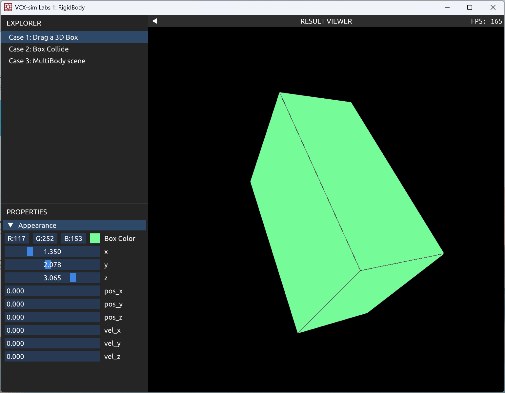
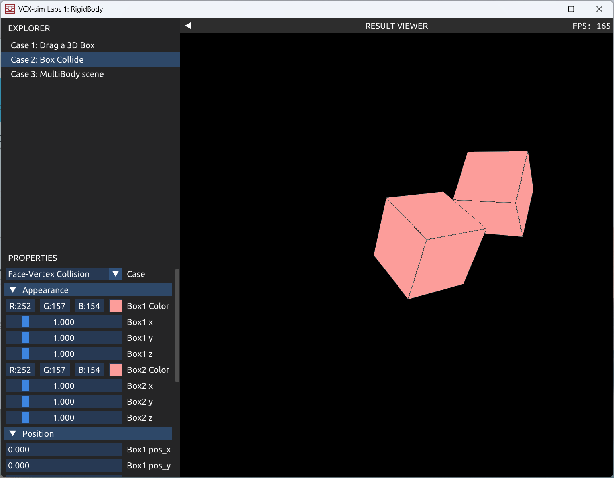
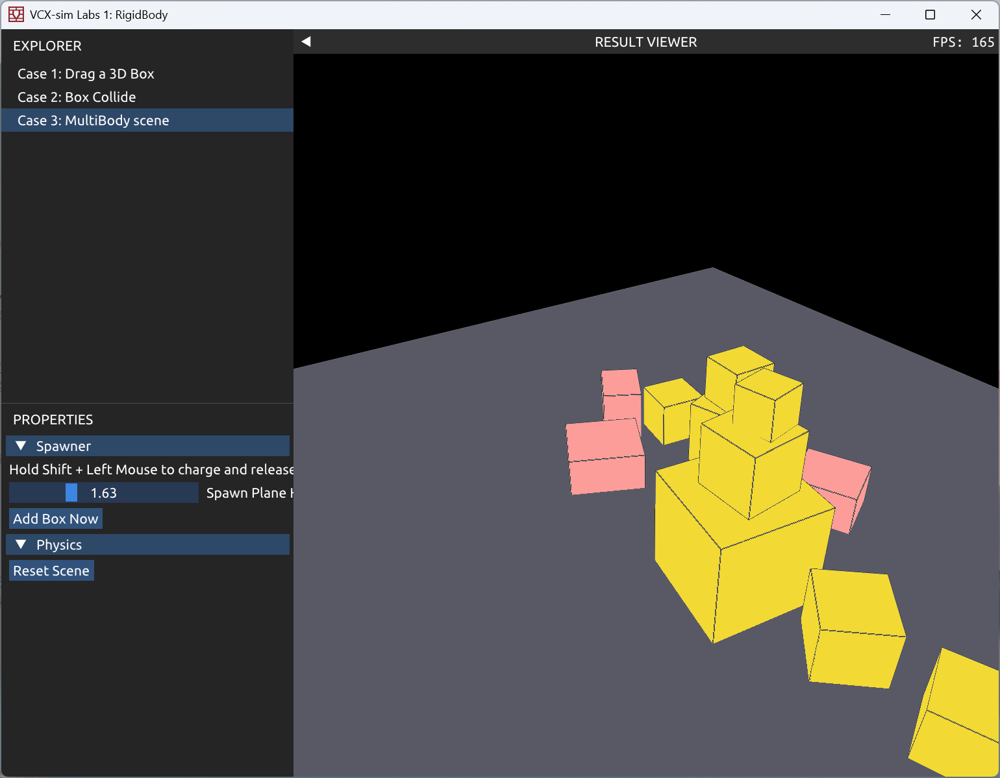

# Report
## Introduction
在整个lab中，可以使用“Alt+F”来Reset Scene。在lab3 中，按住“Shift”的同时按住鼠标左键可以根据按住的时长动态添加盒子
## Task 1: Single Body
在VCX::Labs::RigidBody命名空间里定义了Box这一刚体，并单独放置在RigidBody.h中（因为原本考虑后续可能会有其他形状的刚体加入）。定义了Eigen::Vector3f   velocity,   Eigen::Vector3f     angularvelocity,  Eigen::Quaternionf    orientation等物理量来表示盒子的运动状态。仿照lab0渲染了整个场景。

效果如下：

## Task 2: TwoBody Collision
使用Box   _initialbox[2]来存储场景初始化的信息，便于Resetscene()使用。然后将不同场景的参数用数组存储起来方便调用

点面撞击效果如下：


## Task 3：MultiBody
在这里同时完成了Bonus“B2 多体稳定堆叠探索”的问题，并且设定了一个比较有意思的交互，所以稍稍复杂了一些。大致说明一下变量的含义：

```
std::vector<Box>                                _initialBoxes;//存储初始场景信息
std::vector<Box>                                _boxes;//存储盒子
Box                                             _ground;//地面，没有设置墙壁
std::vector<ContactEntry>                       _contacts;//存储接触信息
int                                             _boxCount = 3;//盒子数

bool                                            _recompute = true;//是否重新计算场景
float                                           _restitution = 0.35f;//弹性系数
float                                           _gravity = 9.8f;//重力加速度
float                                           _groundHeight = -1.5f;//设置地面高度，这是后续添加盒子要用到的
int                                             _solverIterations = 10;//最大迭代次数
float                                           _correctionBeta = 0.25f;//位置修正系数，越大越快消除穿透，但过大可能抖动
float                                           _penetrationSlop = 0.003f;//允许的微小穿透容差，用于减小抖动
float                                           _friction = 0.65f;//摩擦系数
float                                           _restitutionVelocityThreshold = 0.5f;//低于该相对速度时不做弹性反弹，避免小幅抖动
float                                           _fixedTimeStep = 1.0f / 120.0f;//固定时间步
int                                             _maxSubSteps = 8;//每帧最多子步数，防止低帧率时数值爆炸
float                                           _timeAccumulator = 0.0f;//时间累加器，用于固定步长推进

float                                           _linearDamping = 0.08f;//线速度阻尼
float                                           _angularDamping = 0.12f;//角速度阻尼
float                                           _sleepLinearThreshold = 0.06f;//休眠线速度阈值
float                                           _sleepAngularThreshold = 0.08f;//休眠角速度阈值
int                                             _sleepFramesThreshold = 20;//连续低速多少帧后进入休眠
float                                           _spawnPlaneHeight = 2.0f;//添加盒子时射线求交的平面高度（可调）
std::vector<int>                                _sleepCounters;//每个盒子的休眠计数器

bool                                           _isCharging=false;//是否在充能，即按住鼠标左键
float                                          _chargeTime=0.f;//记录时间来换算成盒子大小
float                                          _maxChargeTime=2.f;//最大充能时间，限制盒子大小
float                                          _minChargeTime=0.05f;//最小充能时间，限制盒子大小
float                                         _phro=2.f;//密度
Box                                           _PreviewBox;//用于充能过程中的预览
ImVec2                                        _mousePos { 0.f, 0.f };//鼠标在渲染区域内的位置
std::pair<std::uint32_t, std::uint32_t>      _renderSize { 1u, 1u };//当前渲染分辨率，用于屏幕坐标反投影
```

受童年小游戏“整蛊火柴人启发”，我设计了一个三维场景的交互：
在初始场景中有随机的三个盒子从空中降落到地板上，在按住shift和鼠标左键的情况下，代码会将“视线”（）与设定的高度（spawn height ）求交，并设定为新添加盒子的中心位置，并记录充能时间来换算成盒子的大小并实时渲染，然后充能结束的时候盒子落下，并与场景中的其他盒子进行交互，场景中的盒子数量可以远远大于四，并允许堆叠。同时，针对穿模的情况也做了优化，尽可能地避免添加盒子过程中的穿模现象。

演示效果在Bonus部分中。
## Bonus
继续上面的叙述，如果只是运用最简单的冲量法，盒子是不会稳定的，即使是两层堆叠也会剧烈的弹开，然后在地板上起舞，更别提三层堆叠。
为此，在冲量法的基础上，我做了一些改进，包括但不限于：
1. 固定时间步减少帧率波动对仿真的影响。
2. 设定线性/角速度阻尼（_linearDamping, _angularDamping），衰减非物理高频振荡。
3. 设置休眠机制（_sleepLinearThreshold, _sleepAngularThreshold, _sleepFramesThreshold），使接近静止的盒子保持休眠。

最终使得盒子在地面上是完全稳定的，在两层堆叠下能够保持较好的稳定，在三层堆叠的情况（如果场景是盒子呈金字塔状）也能保持一定时间的稳定（依然会存在弹跳的抖动，但能够维持一段时间，不过如果本来就不是稳定的结构，例如倒三角等，还是会产生比较剧烈的抖动）
演示效果如图，可以自己交互试一试：

